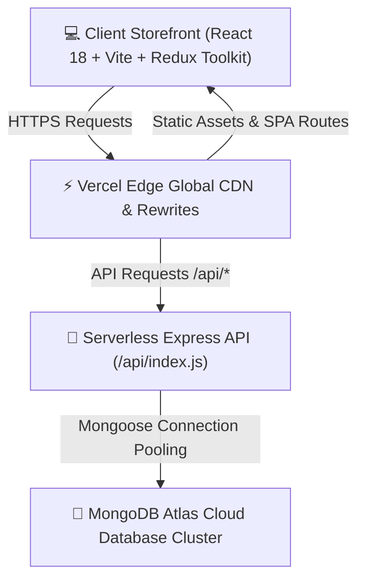
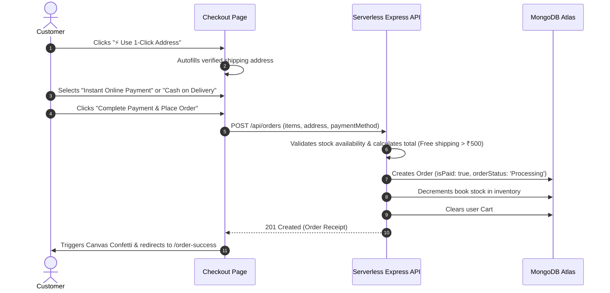

# 📖 BookCart — Comprehensive Project Documentation

---

## 📑 Table of Contents
1. [Executive Summary](#1-executive-summary)
2. [System Architecture](#2-system-architecture)
   - [High-Level Architecture Diagram](#high-level-architecture-diagram)
   - [Frontend Architecture & State Management](#frontend-architecture--state-management)
   - [Backend Architecture & Serverless API](#backend-architecture--serverless-api)
   - [Database & Storage Layer](#database--storage-layer)
3. [End-to-End Application Workflows](#3-end-to-end-application-workflows)
   - [Customer Authentication & Authorization Workflow](#customer-authentication--authorization-workflow)
   - [Catalog Discovery & Multi-Faceted Filtering](#catalog-discovery--multi-faceted-filtering)
   - [Shopping Cart & Wishlist Synchronization](#shopping-cart--wishlist-synchronization)
   - [Single-Page 1-Click Checkout & Payment Lifecycle](#single-page-1-click-checkout--payment-lifecycle)
   - [Admin ERP & Fulfillment Workflow](#admin-erp--fulfillment-workflow)
4. [Technology Stack & Developer Tools](#4-technology-stack--developer-tools)
5. [Database Schemas & Data Modeling](#5-database-schemas--data-modeling)
6. [REST API Specification](#6-rest-api-specification)
7. [Security, Performance & Resilience](#7-security-performance--resilience)
8. [Deployment & Infrastructure Configuration](#8-deployment--infrastructure-configuration)

---

## 1. Executive Summary

**BookCart** is a modern, full-stack, enterprise-grade e-commerce bookstore web application. Engineered using the **MERN Stack** (MongoDB Atlas, Express.js, React 18, Node.js) and bundled with **Vite**, BookCart bridges aesthetic digital storefronts with robust administrative ERP inventory and order fulfillment operations.

The system features dynamic low-cost pricing (₹59 to ₹199), a responsive Dark/Light theme with electric neon orange branding, 1-Click Address autofill checkout, instant payment confirmation, real-time shipment progression tracking, and an administrative control panel with analytics and catalog management.

---

## 2. System Architecture

### High-Level Architecture Diagram



---

### Frontend Architecture & State Management

The frontend is built with **React 18** and **Vite**, organized in a modular component-driven structure:

```
client/src/
├── components/          # Reusable UI components (Navbar, BookCard, Footer, Loader, ErrorBoundary)
├── context/             # Global ThemeContext (Dark/Light mode persistence)
├── pages/               # Page Views
│   ├── Home.jsx         # Hero banner, featured categories, special deals
│   ├── Books.jsx        # Catalog, search, filters, pagination
│   ├── BookDetails.jsx  # Book viewer, reviews, add to cart
│   ├── Cart.jsx         # Quantity stepper, subtotal, discount calculation
│   ├── Checkout.jsx     # 1-Click address autofill, instant payment
│   ├── Orders.jsx       # Past order history & live delivery badges
│   ├── OrderDetails.jsx # Detailed shipment timeline & invoice
│   ├── Profile.jsx      # User profile & address book manager
│   ├── About.jsx        # Brand story with dark mode contrast
│   ├── Contact.jsx      # Contact form & customer support
│   └── admin/           # Admin Dashboard, Inventory, Orders, Users, Analytics
├── redux/               # Redux Toolkit Slices (auth, cart, order, book, wishlist, admin)
└── services/            # Axios API client with automatic JWT bearer interceptor
```

#### Global Redux State Architecture
- **`authSlice`**: Stores authenticated user profile, role (`customer` | `admin`), and JWT token in synchronized `localStorage`.
- **`cartSlice`**: Tracks real-time cart items, quantities, subtotal calculations, and item counts.
- **`wishlistSlice`**: Persists saved wishlist items across active sessions.
- **`bookSlice`**: Manages catalog queries, debounce search parameters, category filters, and active pagination.
- **`orderSlice`**: Handles checkout execution, user order lists, and granular order details.
- **`adminSlice`**: Powers admin metrics (revenue, total orders, low stock items, user management).

---

### Backend Architecture & Serverless API

The backend is built with **Node.js (ES Modules)** and **Express.js**, designed to run as both a local development server and a serverless lambda distribution on **Vercel**:

```mermaid
graph LR
    Req["📥 Incoming Request (/api/*)"] --> Cors["🛡️ CORS & Helmet"]
    Cors --> RateLimit["⏱️ Rate Limiter (500 req/15min)"]
    RateLimit --> DBMiddleware["🍃 Mongoose Connection Caching"]
    DBMiddleware --> AuthMiddleware["🔐 JWT Auth & Role Validation"]
    AuthMiddleware --> Controllers["⚙️ Route Controllers"]
    Controllers --> Models["🗄️ Mongoose Data Models"]
    Models --> Atlas["🍃 MongoDB Atlas Cluster"]
```



---

## 3. End-to-End Application Workflows

### Customer Authentication & Authorization Workflow
1. User enters credentials on `/login` or registers on `/register`.
2. Backend hashes password using `bcryptjs` (salt factor 10) and signs a JSON Web Token (`JWT_SECRET`, 30-day expiry).
3. Client stores token and user payload in Redux & `localStorage`.
4. Axios request interceptor attaches `Authorization: Bearer <token>` to every subsequent API call.
5. `authMiddleware.js` (`protect`) verifies token signature, and `adminMiddleware.js` (`admin`) guards administrative endpoints (`/api/admin/*`).

---

### Catalog Discovery & Multi-Faceted Filtering
1. **Debounce Search**: As the user types in the search bar, queries are debounced to prevent unnecessary network load.
2. **Filtering Engine**: Backend filters by `$regex` on title/author/ISBN, matching category IDs, and price range boundary queries (`price: { $gte: min, $lte: max }`).
3. **Sorting**: Dynamic sorting by `price-asc`, `price-desc`, `rating`, or `newest`.
4. **Pagination**: Server returns paginated records with total count and calculated page metadata.

---

### Shopping Cart & Wishlist Synchronization
1. When a user clicks **"Add to Cart"**, the application dispatches an async Redux action.
2. If authenticated, the backend synchronizes the item in the `Cart` collection; if guest, local state manages the cart.
3. **Auto-Expanding Badge**: The shopping bag in the Navbar displays a bold pill badge (`min-w-[20px] h-5 px-1.5`) displaying the count.
4. Toast notifications explicitly display added quantity and current cart total.

---

### Single-Page 1-Click Checkout & Payment Lifecycle



---

### Admin ERP & Fulfillment Workflow
1. **Analytics Hub**: Real-time aggregation pipeline calculating total gross sales, completed orders, low-stock threshold warnings (< 5 copies), and customer count.
2. **Catalog Management**: Add new books with custom cover uploads, modify prices, or delete outdated listings.
3. **Order Lifecycle Pipeline**: Admin updates order fulfillment status (`Processing` ➔ `Shipped` ➔ `Delivered` ➔ `Cancelled`). Cancelling an order automatically restores book stock to inventory.

---

## 4. Technology Stack & Developer Tools

| Category | Technology / Library | Purpose |
|---|---|---|
| **Frontend Framework** | React 18.3 | Dynamic reactive component rendering |
| **Build Tool & Bundler** | Vite 5.4 + esbuild | Fast HMR dev server & optimized production minification |
| **State Management** | Redux Toolkit 2.2 + React Redux | Predictable centralized global state |
| **Routing** | React Router DOM v6.26 | Client-side Single Page Application (SPA) routing |
| **Styling & Design** | Tailwind CSS v3.4 + PostCSS | Modern responsive design system with Dark/Light modes |
| **Icons & Visuals** | Lucide React | Clean, scalable modern icons |
| **Notifications** | React Hot Toast | Responsive toast alert popups |
| **Celebrations** | Canvas Confetti | Visual confetti on successful order checkout |
| **Backend Runtime** | Node.js (ES Modules) | Asynchronous backend JavaScript runtime |
| **API Framework** | Express.js 4.19 | RESTful API routing, middleware chaining, and controllers |
| **Database** | MongoDB Atlas Cluster | Managed cloud NoSQL database |
| **ODM Layer** | Mongoose 8.5 | Object Data Modeling and schema enforcement |
| **Authentication** | JSON Web Tokens (JWT) + bcryptjs | Secure stateless authentication and password hashing |
| **Security Headers** | Helmet + CORS + Rate Limiter | HTTP security hardening and DDoS protection |
| **Deployment Platform** | Vercel | Global Edge CDN hosting for SPA & serverless API |
| **Version Control** | Git & GitHub | Source code tracking and CI/CD triggers |

---

## 5. Database Schemas & Data Modeling

### 1. User Schema (`User.js`)
```javascript
{
  name: { type: String, required: true },
  email: { type: String, required: true, unique: true, lowercase: true },
  password: { type: String, required: true, select: false },
  role: { type: String, enum: ['customer', 'admin'], default: 'customer' },
  avatar: { type: String, default: 'default_avatar_url' },
  addresses: [{
    fullName: String,
    phone: String,
    addressLine: String,
    city: String,
    state: String,
    postalCode: String,
    country: String,
    isDefault: Boolean
  }],
  isBlocked: { type: Boolean, default: false },
  createdAt: { type: Date, default: Date.now }
}
```

### 2. Book Schema (`Book.js`)
```javascript
{
  title: { type: String, required: true, trim: true },
  author: { type: String, required: true, trim: true },
  isbn: { type: String, required: true, unique: true },
  description: { type: String, required: true },
  price: { type: Number, required: true, min: 0 },
  discountPrice: { type: Number, default: 0 },
  category: { type: mongoose.Schema.Types.ObjectId, ref: 'Category', required: true },
  image: { type: String, required: true },
  stock: { type: Number, required: true, default: 0 },
  rating: { type: Number, default: 0 },
  numReviews: { type: Number, default: 0 },
  featured: { type: Boolean, default: false }
}
```

### 3. Order Schema (`Order.js`)
```javascript
{
  user: { type: mongoose.Schema.Types.ObjectId, ref: 'User', required: true },
  orderItems: [{
    book: { type: mongoose.Schema.Types.ObjectId, ref: 'Book', required: true },
    title: String,
    image: String,
    price: Number,
    quantity: Number
  }],
  shippingAddress: {
    fullName: String,
    phone: String,
    addressLine: String,
    city: String,
    state: String,
    postalCode: String,
    country: String
  },
  paymentMethod: { type: String, enum: ['Online', 'COD'], required: true },
  isPaid: { type: Boolean, default: false },
  paidAt: Date,
  itemsPrice: Number,
  shippingPrice: Number,
  totalPrice: Number,
  orderStatus: { type: String, enum: ['Processing', 'Shipped', 'Delivered', 'Cancelled'], default: 'Processing' },
  statusHistory: [{
    status: String,
    timestamp: { type: Date, default: Date.now },
    note: String
  }],
  createdAt: { type: Date, default: Date.now }
}
```

---

## 6. REST API Specification

| Method | Endpoint | Access | Description |
|---|---|---|---|
| **POST** | `/api/auth/register` | Public | Register new user account |
| **POST** | `/api/auth/login` | Public | Authenticate user & issue JWT |
| **GET** | `/api/auth/profile` | Private | Get authenticated user profile |
| **PUT** | `/api/auth/profile` | Private | Update user details / address book |
| **GET** | `/api/books` | Public | Get paginated books with search & filter params |
| **GET** | `/api/books/:id` | Public | Get single book details & reviews |
| **POST** | `/api/books/:id/reviews` | Private | Post customer rating & review |
| **GET** | `/api/categories` | Public | List all available book genres |
| **GET** | `/api/cart` | Private | Get active user cart |
| **POST** | `/api/cart` | Private | Add item / update quantity in cart |
| **DELETE**| `/api/cart/:bookId` | Private | Remove item from cart |
| **POST** | `/api/orders` | Private | Create new order and clear cart |
| **GET** | `/api/orders/my-orders` | Private | List all past customer orders |
| **GET** | `/api/orders/:id` | Private | Get detailed order timeline |
| **GET** | `/api/admin/stats` | Admin | Get analytics metrics (revenue, orders, users) |
| **POST** | `/api/admin/books` | Admin | Create new book with cover asset |
| **PUT** | `/api/admin/books/:id` | Admin | Update book pricing, stock, metadata |
| **DELETE**| `/api/admin/books/:id` | Admin | Remove book listing |
| **GET** | `/api/admin/orders` | Admin | View all store orders across all users |
| **PUT** | `/api/admin/orders/:id/status` | Admin | Update order status stage |
| **GET** | `/api/health` | Public | Serverless health & uptime monitoring |

---

## 7. Security, Performance & Resilience

1. **Password Hashing**: `bcryptjs` with salt round factor 10 to ensure zero plaintext password exposure.
2. **Stateless JWT Tokens**: Signed tokens with tamper-proof HMAC SHA-256 verification.
3. **HTTP Header Protection**: Configured `helmet` to protect against XSS, clickjacking, and MIME sniffing attacks.
4. **Rate Limiting**: `express-rate-limit` restricting IPs to 500 requests per 15-minute window with `trust proxy` enabled for cloud reverse proxies.
5. **Connection Pooling**: Global cached Mongoose connection preventing cold-start exhaustion on serverless lambdas.
6. **Error Boundary**: React Error Boundary component capturing runtime UI crashes and offering 1-click recovery without full application collapse.
7. **Cross-Origin Resource Sharing**: Configured `cors({ origin: '*', credentials: true })` for cross-platform compatibility.

---

## 8. Deployment & Infrastructure Configuration

- **Frontend Hosting**: Vercel Global Edge Network with automatic Single Page Application rewrites (`client/dist`).
- **Serverless API Hosting**: Standalone `api/index.js` bundled via `esbuild` to execute as Vercel Serverless Functions on AWS Lambda.
- **Database**: MongoDB Atlas AWS cloud cluster with `0.0.0.0/0` (Allow Access from Anywhere) enabled in Network Access.
- **Environment Variables**:
  - `MONGODB_URI`: MongoDB Atlas cluster connection string.
  - `JWT_SECRET`: Secret key for JWT signing.
  - `JWT_EXPIRE`: Token expiration duration (e.g. `30d`).
  - `NODE_ENV`: `production`.

---

## 👨‍💻 Maintainer & Author

- **Author**: Pratham Shahi
- **Project**: BookCart — MERN Stack Online Bookstore
- **Live Demo**: [https://book-cart-omega.vercel.app](https://book-cart-omega.vercel.app)
- **Repository**: [https://github.com/prathamshahi1/BookCart](https://github.com/prathamshahi1/BookCart)
